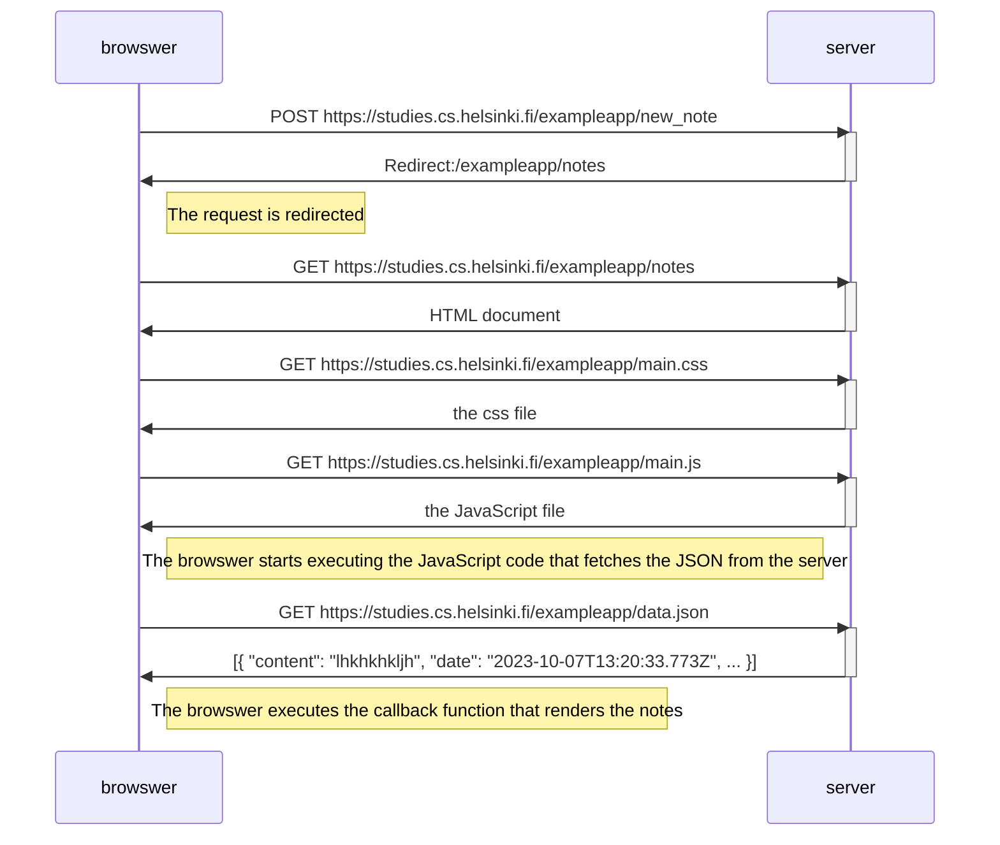

```mermaid
sequenceDiagram
    participant browswer
    participant server

    browswer->>server: POST https://studies.cs.helsinki.fi/exampleapp/new_note
    activate server
    server->>browswer: Redirect:/exampleapp/notes
    deactivate server

    Note right of browswer: The request is redirected

    browswer->>server: GET https://studies.cs.helsinki.fi/exampleapp/notes
    activate server
    server->>browswer: HTML document
    deactivate server

    browswer->>server: GET https://studies.cs.helsinki.fi/exampleapp/main.css
    activate server
    server->>browswer: the css file
    deactivate server

    browswer->>server: GET https://studies.cs.helsinki.fi/exampleapp/main.js
    activate server
    server->>browswer: the JavaScript file
    deactivate server

    Note right of browswer: The browswer starts executing the JavaScript code that fetches the JSON from the server

    browswer->>server: GET https://studies.cs.helsinki.fi/exampleapp/data.json
    activate server
    server->>browswer: [{ "content": "lhkhkhkljh", "date": "2023-10-07T13:20:33.773Z", ... }]
    deactivate server

    Note right of browswer: The browswer executes the callback function that renders the notes

```
