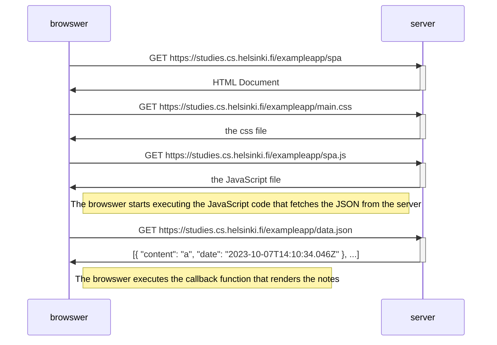

```mermaid
sequenceDiagram
    participant browswer
    participant server

    browswer->>server: GET https://studies.cs.helsinki.fi/exampleapp/spa
    activate server
    server->>browswer: HTML Document
    deactivate server

    browswer->>server: GET https://studies.cs.helsinki.fi/exampleapp/main.css
    activate server
    server->>browswer: the css file
    deactivate server

    browswer->>server: GET https://studies.cs.helsinki.fi/exampleapp/spa.js
    activate server
    server->>browswer: the JavaScript file
    deactivate server

    Note right of browswer: The browswer starts executing the JavaScript code that fetches the JSON from the server

    browswer->>server: GET https://studies.cs.helsinki.fi/exampleapp/data.json
    activate server
    server->>browswer: [{ "content": "a", "date": "2023-10-07T14:10:34.046Z" }, ...]
    deactivate server

    Note right of browswer: The browswer executes the callback function that renders the notes
```
