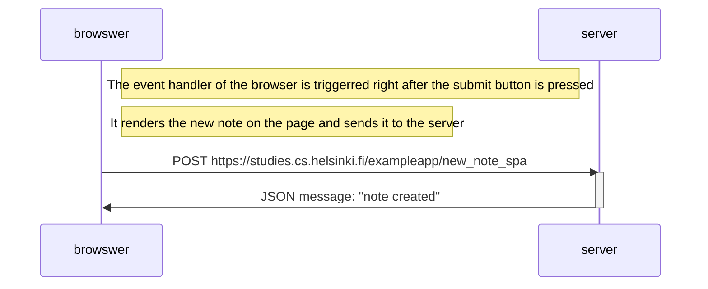

```mermaid
sequenceDiagram
    participant browswer
    participant server

    NOTE right of browswer: The event handler of the browser is triggerred right after the submit button is pressed
    NOTE right of browswer: It renders the new note on the page and sends it to the server

    browswer->>server: POST https://studies.cs.helsinki.fi/exampleapp/new_note_spa
    activate server
    server->>browswer: JSON message: "note created"
    deactivate server


```
